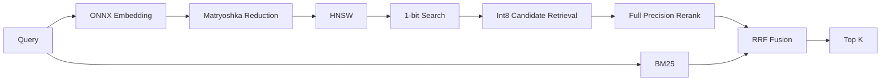
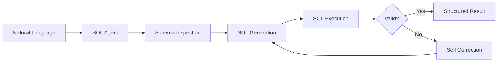
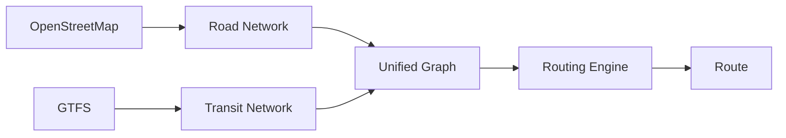

<p align="center">
  
</p>

<p align="center">
  
</p>

<p align="center">
  <a href="mailto:07pavanteja@gmail.com">
    
  </a>
  <a href="https://www.linkedin.com/in/pavan-teja">
    
  </a>
  <a href="https://github.com/PavanTejaAI">
    
  </a>
</p>

<p align="center">
  
</p>

---

# About

I am an **AI Engineer with 2+ years of experience** building production systems across:

**Agentic AI · RAG · Retrieval Systems · LLM Inference · Computer Vision · Voice AI · Backend Infrastructure · Cloud Systems**

I enjoy working where **AI engineering meets systems engineering**, turning models and research ideas into software that has to perform under real production constraints.

My engineering focus is:

`Latency` · `Throughput` · `Retrieval Quality` · `Memory Efficiency` · `Reliability` · `Security` · `Observability` · `Inference Cost`

> **I build AI systems where intelligence meets engineering.**

---

# What I Build

```text
                         AI Systems
                             │
        ┌────────────────────┼────────────────────┐
        │                    │                    │
        ▼                    ▼                    ▼
    Retrieval             Agents              Inference
        │                    │                    │
   Dense Search          Tool Use             GPU Serving
   Hybrid Search         MCP                   Quantization
   Graph Search          CodeAct               ONNX
   Reranking             Multi-Agent           vLLM
   RAG                   Memory                Triton
        │                    │                    │
        └────────────────────┼────────────────────┘
                             ▼
                       Production Layer
                             │
              ┌──────────────┼──────────────┐
              ▼              ▼              ▼
           APIs           Cloud       Observability
        FastAPI/SSE      AWS/ECS       Metrics/Logs
        WebSockets       SQS/Lambda     Reliability
```

---

# Open Source

## ⚡ swiftvec

<p align="left">
  <a href="https://github.com/PavanTejaAI/swiftvec">
    
  </a>
  <a href="https://pypi.org/project/swiftvec/">
    
  </a>
  <a href="https://crates.io/crates/swiftvec-core">
    
  </a>
</p>

### On-device Vector Search Engine

**Rust · HNSW · SIMD · BM25 · ONNX Runtime · Quantization**

`swiftvec` is a local-first vector search engine designed around **low latency, compact memory usage and offline execution**.

> **Semantic search designed to stay close to the device.**



### Core Design

**Rust search core**

**HNSW implemented from scratch**

**Heuristic neighbor selection**

**AVX2 and FMA SIMD kernels**

**1-bit Hamming search**

**Int8 candidate retrieval**

**Full-precision reranking**

**Matryoshka 768D → 256D**

**BM25 + dense hybrid search**

**RRF fusion**

**Metadata filtering during graph traversal**

**Memory-mapped snapshots**

**Zero-copy loading**

**Quantized ONNX embeddings**

**Python package**

**Rust crate**

**Cross-platform wheels**

### Benchmark

| System       | Hardware     |         P50 |         P99 |      Recall@5 |
| :----------- | :----------- | ----------: | ----------: | ------------: |
| **swiftvec** | Intel i5     | **2.54 ms** | **3.31 ms** |     **0.960** |
| moss         | Apple M4 Pro |      3.1 ms |      5.4 ms | Not published |
| ChromaDB     | moss setup   |    351.8 ms |    538.5 ms | Not published |
| Qdrant       | moss setup   |    597.6 ms |    771.4 ms | Not published |

### Benchmark Methodology

**100K-document corpus**

**Exact brute-force oracle**

**Recall measured independently from latency**

### Python

```python
from swiftvec import SwiftVec

db = SwiftVec()

db.add_batch(
    ["doc-1", "doc-2"],
    [
        "Vector search by meaning",
        "Photosynthesis converts sunlight"
    ],
    metadatas=[
        {"topic": "ir"},
        {"topic": "bio"}
    ]
)

results = db.search(
    "how does fast similarity search work",
    top_k=3
)
```

---

## 🤖 Quantum Lens SmartSQL Agent

<p align="left">
  <a href="https://github.com/PavanTejaAI/quantum-lens-SmartSQL-Agent">
    
  </a>
</p>

**Python · LangChain · SQLAlchemy · FastAPI**

An autonomous text-to-SQL agent that converts natural language into executable database queries.



### Capabilities

**Natural-language database querying**

**Schema inspection**

**SQL generation**

**SQL execution**

**Join correction**

**Syntax correction**

**Self-correction loops**

**SQLAlchemy integration**

**FastAPI backend**

**Structured JSON responses**

**JWT-based multi-tenancy**

---

## 🤖 AutoML Orchestrator

<p align="left">
  <a href="https://github.com/PavanTejaAI/automl-orchestrator">
    
  </a>
</p>

A multi-agent AutoML workflow designed to automate the path from dataset understanding to experimentation and model development.

**Dataset analysis**

**Model selection**

**Training orchestration**

**Agent-based experimentation**

**Automated ML workflows**

---

## 🗺️ Multimodal Routing Engine

<p align="left">
  <a href="https://github.com/PavanTejaAI/Multimodal-Routing-Engine">
    
  </a>
</p>

**OpenStreetMap · GTFS · Graph Algorithms**

A routing engine exploring a unified representation of road and public-transit networks.



**Graph construction**

**Road networks**

**Transit networks**

**Unified graph representation**

**Low-latency routing**

---

# Technology Stack

## Languages

<p align="left">
  
</p>

`Python` `Rust` `TypeScript` `JavaScript` `Node.js` `C++` `SQL`

---

## Generative AI

<p align="left">
  
  
  
  
  
</p>

`LLMs` `RAG` `Agentic AI` `LangChain` `LangGraph` `MCP` `CodeAct` `Function Calling` `Prompt Engineering` `LoRA` `QLoRA`

---

## Retrieval and Search

<p align="left">
  
  
  
  
  
  
</p>

`Vespa` `FalkorDB` `Neo4j` `FAISS` `Weaviate` `LanceDB` `HNSW` `Embeddings` `BM25` `Dense Retrieval` `Hybrid Search` `RRF` `Binary Quantization`

---

## Machine Learning and Deep Learning

<p align="left">
  
</p>

<p align="left">
  
  
  
</p>

`PyTorch` `TensorFlow` `Scikit-learn` `Hugging Face Transformers` `NumPy` `Pandas`

---

## Inference and Model Serving

<p align="left">
  
  
  
  
  
  
</p>

`vLLM` `Triton Inference Server` `ONNX Runtime` `TensorRT` `llama.cpp` `whisper.cpp` `FP8` `KV Cache` `Quantization` `Model Optimization`

---

## Computer Vision and Voice AI

<p align="left">
  
</p>

<p align="left">
  
  
  
  
</p>

`SCRFD` `OpenCV` `MediaPipe` `Face Recognition` `Speech-to-Text` `Speaker Diarization` `Speaker Verification` `Speech Enhancement` `Source Separation` `LiveKit Agents`

---

## Backend and APIs

<p align="left">
  
</p>

`FastAPI` `REST APIs` `WebSockets` `SSE` `Redis` `MongoDB` `MySQL` `Node.js` `Express`

---

## Cloud and Infrastructure

<p align="left">
  
</p>

<p align="left">
  
  
  
  
  
</p>

`AWS` `GCP` `ECS` `EC2` `Lambda` `SQS` `S3` `ECR` `Vertex AI` `Docker` `Kubernetes` `Linux` `CI/CD`

---

## Observability and Engineering

<p align="left">
  
  
  
  
</p>

`Prometheus` `Grafana` `Loki` `Git` `CI/CD` `Containerized Deployments` `Monitoring` `Production Operations`

---

# Engineering Principles

### Measure First

**Latency · Throughput · Recall · Accuracy · Memory · GPU Utilization · Cost**

### Optimize the Bottleneck

**Quantization · Batching · Caching · Reranking · SIMD · Efficient Indexing · Local Inference**

### Retrieval Is a System

```text
Ingestion
   ↓
Chunking
   ↓
Indexing
   ↓
Retrieval
   ↓
Filtering
   ↓
Reranking
   ↓
Fusion
   ↓
Evaluation
```

### Production Means Failure Handling

**Timeouts · Retries · Fallbacks · Isolation · Security · Observability · Rollbacks · Cost Controls**

### Reproducibility Matters

**Benchmarks over opinions**

**Evaluation over demos**

**Measured trade-offs over hype**

---

# Experience

| Organization                      | Role                      | Period              |
| :-------------------------------- | :------------------------ | :------------------ |
| **VE The Intent Company**         | AI Engineer               | Aug 2024 - Present  |
| **Sankalpa Projects Consultancy** | Software Developer Intern | Jul 2023 - Jan 2024 |
| **Ranvi Technologies**            | Software Developer Intern | Feb 2023 - Jul 2023 |

---

# Education

## Malla Reddy College of Engineering & Technology

**B.Tech, Computer Science & Engineering, Data Science**

2021 - 2024 · Hyderabad, India

`Machine Learning` `Deep Learning` `NLP` `Data Mining` `Big Data Analytics` `DBMS` `Data Structures & Algorithms`

## Madhira Institute of Technology & Sciences

**Diploma, Mechanical Engineering**

2018 - 2021

---

# Current Focus

### Agentic AI

`MCP` `Tool Use` `CodeAct` `Multi-Agent Systems` `Planning` `Orchestration` `Long-term Memory`

### Retrieval

`RAG` `Vector Search` `Graph Retrieval` `Hybrid Search` `Quantization` `Reranking` `Retrieval Evaluation`

### Inference

`GPU Serving` `Quantization` `Batching` `KV Cache Optimization` `Low-latency Inference`

### On-device AI

`Local LLMs` `Private Inference` `On-device Retrieval` `SIMD` `Efficient Local Compute`

---

# The Problem I Like Working On

```text
                 AI Applications
                        │
                        ▼
                 More Intelligent
                        │
                        ▼
                    More Useful
                        │
          ┌─────────────┼─────────────┐
          ▼             ▼             ▼
        Faster        Cheaper       Private
          │             │             │
          └─────────────┼─────────────┘
                        ▼
                    Reliable
                        │
                        ▼
                  Production Scale
```

> **How do we make AI systems faster, cheaper, more reliable, more accurate and more private while keeping them practical to operate?**

That is the class of problems I want to keep solving.

---

# GitHub Activity

<p align="left">
  
</p>

<p align="left">
  
</p>

### Contribution Graph

<p align="left">
  <picture>
    <source
      media="(prefers-color-scheme: dark)"
      srcset="https://raw.githubusercontent.com/PavanTejaAI/PavanTejaAI/output/snake-dark.svg"
    />
    <source
      media="(prefers-color-scheme: light)"
      srcset="https://raw.githubusercontent.com/PavanTejaAI/PavanTejaAI/output/snake.svg"
    />
    
  </picture>
</p>

---

# Connect

<p align="left">
  <a href="mailto:07pavanteja@gmail.com">
    
  </a>
  <a href="https://www.linkedin.com/in/pavan-teja">
    
  </a>
  <a href="https://github.com/PavanTejaAI">
    
  </a>
</p>

<p align="left">
  <strong>Building AI systems where intelligence meets engineering.</strong>
</p>

<p align="center">
  
</p>
